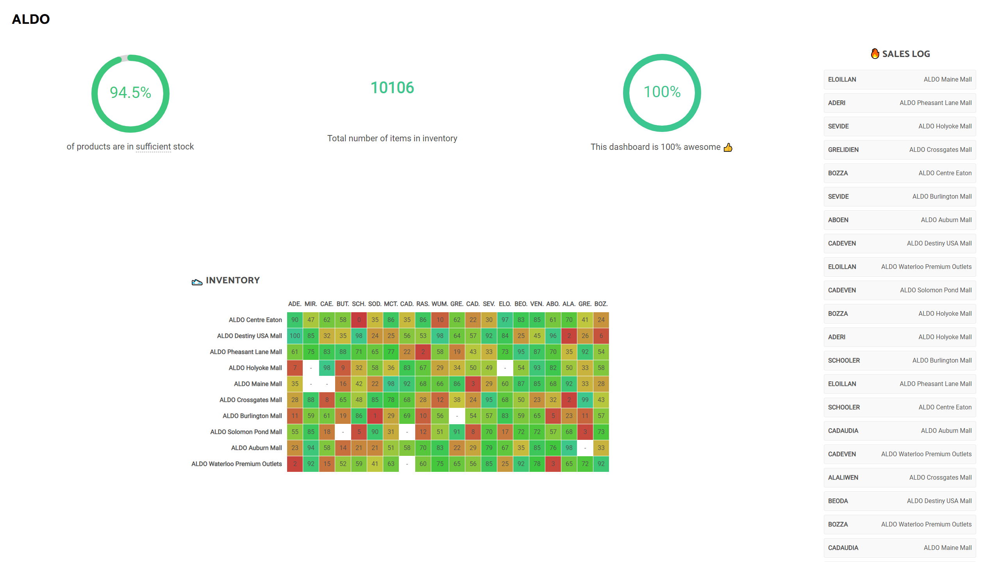
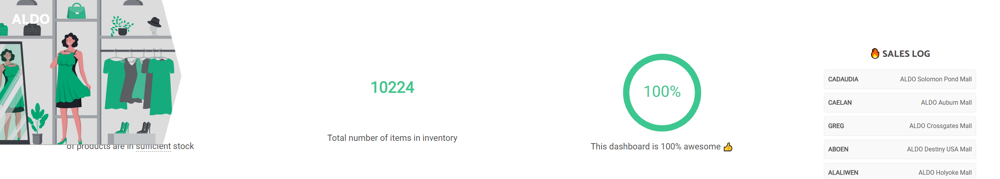

# Shoe Store

## My take on this challenge

With a focus on good UX, this web dashboard should provide all necessary information to monitor shoes' inventories.
The colors make it quick to identify anywhere a product is in low stock.

### Tech stack and sources:
- [create-react-app](https://github.com/facebook/create-react-app)
- [MobX state tree](https://mobx-state-tree.js.org) for state management
- [styled-components](https://styled-components.com/)
- [useHover react hook](https://usehooks.com/useHover/)
- [React circular progressbar](https://www.npmjs.com/package/react-circular-progressbar)
- Fonts: Catamaran and Roboto from Google Fonts
- Shopping image from https://2.flexiple.com/scale/all-illustrations

### What could be improved in the future:
- **Responsive UI**. This would be the next step. Make it work on a variety of screen sizes and on mobile.
- Test on more **browsers** and platforms. For now this was only tested on Chrome on Windows 10.
- Animate the sales log so that it is easier to see products moving down the list.
- I would recommend converting to TypeScript to make it easier to maintain this product, especially if it grows larger.
- Collaborate with the sales team to figure out the right metrics to add!

### Installing
On top of the original installation instructions (see below), you will need to run `npm install` from the root directory.

Then run `npm start` to run the application in dev mode. The page should automatically open in your browser.

### Screenshots

Since the UI is not as responsive as I would like it to be right now, here are some screenshots from a reasonable screen resolution:


===========================


Below is the original readme file:

## Synopsis

Aldo Shoes is having a huge flash sale online. You provide support to the inventory department. They want to react real-time to various inventory problems as they arise.

You adjust the inventory whenever a new sale is completed. The return value includes the store, the shoe model and the inventory left for that shoe model in the store.

```
{
  'store' => 'ALDO Ste-Catherine',
  'model' => 'ADERI',
  'inventory' => 10,
}
```

`ALDO Ste-Catherine` store sold a pair of `ADERI` shoes. `ALDO Ste-Catherine` now has 10 pairs of `ADERI` left.

## Goal

**Design an interface that would allow the inventory department to monitor Aldo's stores and shoes inventory.**

Hope you’ll have fun with this little test. I know I had designing it.
Go wild. It can be anything you want. I’ve seen results printed to console, displayed on a webpage, and even someone who did periodical database dumps.

Here are a few ideas if you need an extra challenge:

- Add some sort of alerting system, e.g. When a shoe model at a store goes too low, or too high.
- Add a REST JSON API, or GraphQL
- Suggest shoe transfers from one store to another according to inventory
- Your own crazy idea!

Share your repository with us when you’re done.

Happy Hacking :)

## Installation

This projects uses the popular library `websocketd` to send messages.

If you're on a Mac, you can install `websocketd` using [Homebrew](http://brew.sh/). Just run `brew install websocketd`. For other operating systems, or if you don't want to use Homebrew, check out the link below.

**[Download for Linux, OS X and Windows](https://github.com/joewalnes/websocketd/wiki/Download-and-install)**

Note that a Ubuntu 64-bit version is already bundled here `bin/websocketd` for convenience.

## Getting Started

### Inventory Server

Your WebSocket Server is the tap that aggregates inventories from all stores.

You can run it directly from your own machine.

Run the following to start tapping into the inventory events.

```
(bin/)websocketd --port=8080 ruby inventory.rb
```

You now have an active connection to their stores opened on port 8080.

### Start listening on each event

Listen and react on each event using a WebSocket client.

Various implementations are at your disposal. Whatever floats your boat.

They all work the same way. Provide a method or a block to be executed whenever a new event occurs.

Here are two examples for our favorite languages:

#### Javascript

Open a console on a non-secured page:

```
var ws = new WebSocket('ws://localhost:8080/');

ws.onmessage = function(event) {
  console.log(event.data);
};
```

#### Ruby

##### Installation

```
gem install faye-websocket
gem install eventmachine
```

##### Example

```
require 'faye/websocket'
require 'eventmachine'
require 'json'

EM.run {
  ws = Faye::WebSocket::Client.new('ws://localhost:8080/')

  ws.on :message do |event|
    p JSON.parse(event.data)
  end
}
```
